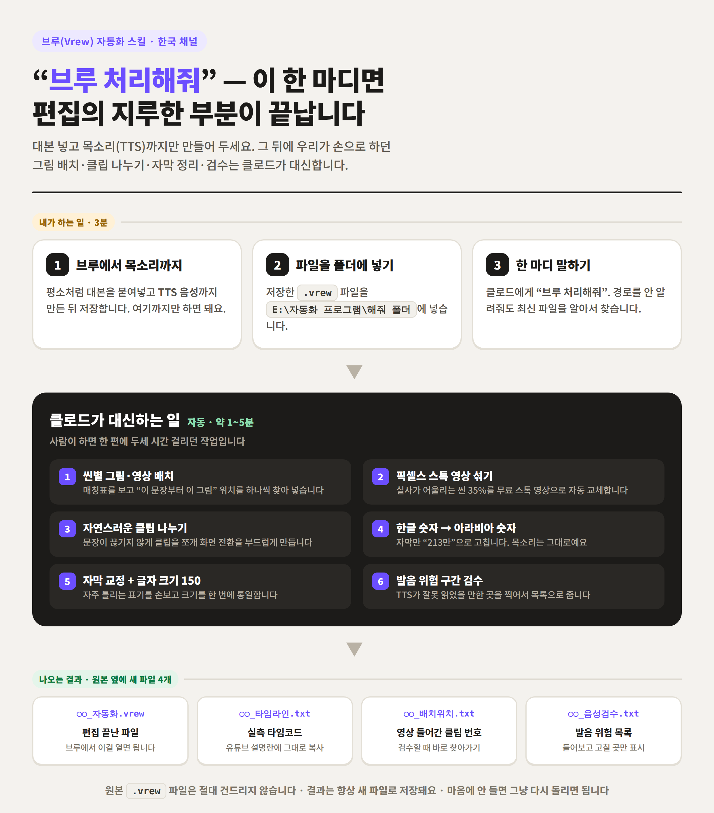
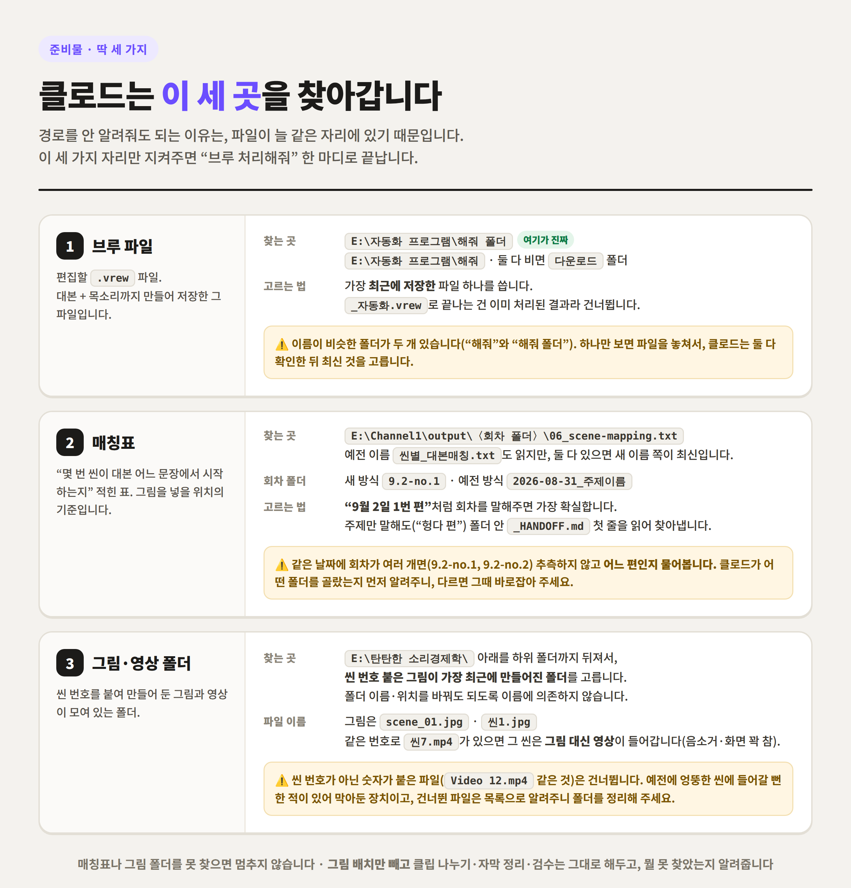
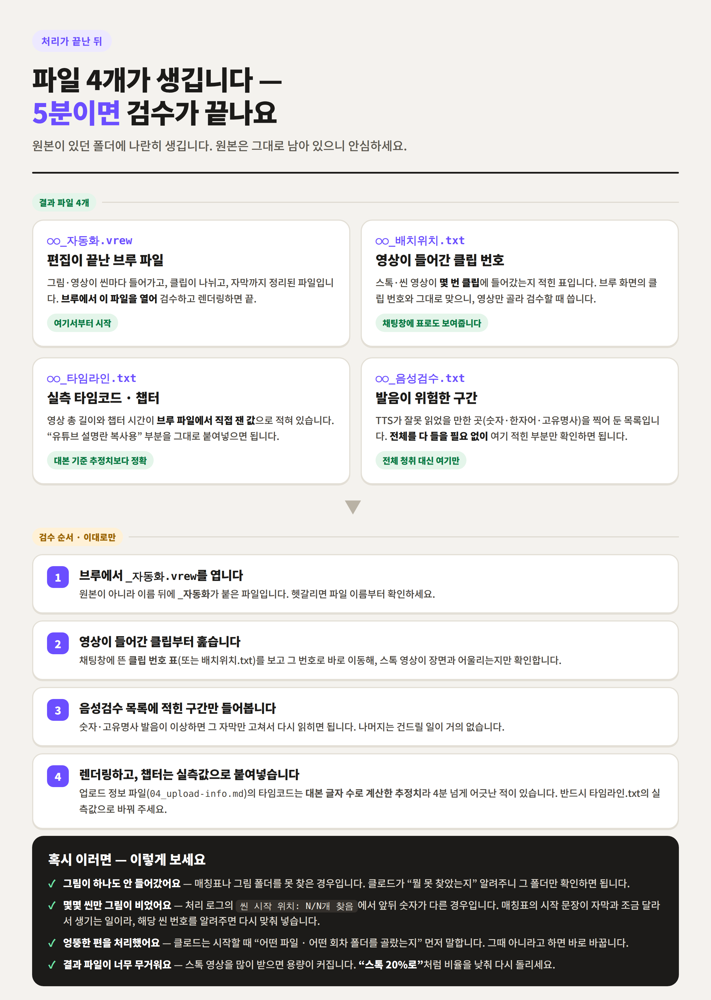
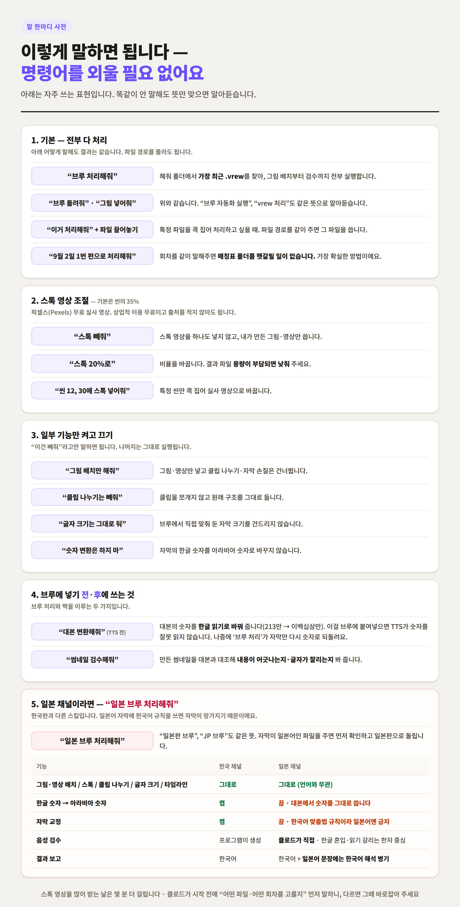

# 브루(Vrew) 자동화 스킬 사용설명서

> 같이 영상 만드는 분들께.
> 제가 쓰고 있는 자동화를 정리했습니다. 개발 지식은 하나도 필요 없고,
> **채팅창에 "브루 처리해줘" 다섯 글자를 치는 게 전부**입니다.

솔직히 말하면, 영상 한 편에서 제일 재미없는 구간은 정해져 있잖아요.
대본 쓰고 목소리 뽑는 것까지는 그래도 창작인데, 그다음부터가 문제죠.

씬 번호 보고 그림 찾아서 끌어다 놓고, 자막 길어서 클립 쪼개고,
"이백십삼만"이라고 써둔 자막을 다시 "213만"으로 고치고, 글자 크기 통일하고,
TTS가 숫자 이상하게 읽은 데 없나 처음부터 끝까지 들어보고…
**한 편에 두세 시간**은 그냥 사라집니다. 창의적인 일도 아닌데요.

이 스킬은 딱 그 구간만 대신합니다. 대본과 목소리는 여전히 내 몫이고,
그 뒤의 손이 많이 가는 작업만 넘기는 겁니다.



---

## 목차

1. [뭐가 달라지나](#1-뭐가-달라지나)
2. [준비 — 딱 한 번만 확인](#2-준비--딱-한-번만-확인)
3. [실제 사용법 3단계](#3-실제-사용법-3단계)
4. [처리 중에 무슨 일이 일어나나](#4-처리-중에-무슨-일이-일어나나)
5. [결과 파일 4개와 검수 순서](#5-결과-파일-4개와-검수-순서)
6. [말 한마디 사전](#6-말-한마디-사전)
7. [일본 채널이라면](#7-일본-채널이라면)
8. [자주 겪는 문제](#8-자주-겪는-문제)
9. [꼭 기억할 것 5가지](#9-꼭-기억할-것-5가지)

---

## 1. 뭐가 달라지나

| 작업 | 지금까지 | 이 스킬을 쓰면 |
|---|---|---|
| 씬별 그림 배치 | 매칭표 보면서 하나씩 끌어다 놓기 | 자동 (문장 위치까지 찾아서) |
| 스톡 실사 영상 | 사이트에서 검색·다운로드·삽입 | 자동 (씬의 35%, 무료 픽셀스) |
| 클립 나누기 | 자막 길이 보면서 수동으로 쪼개기 | 자동 (문장 안 끊기게) |
| 한글 숫자 자막 | 하나씩 찾아 "213만"으로 수정 | 자동 (자막만, 목소리는 그대로) |
| 자막 교정·글자 크기 | 전체 선택해서 손으로 | 자동 (크기 150으로 통일) |
| 발음 검수 | 처음부터 끝까지 들어보기 | 위험한 구간만 목록으로 |
| 챕터 타임코드 | 대본 글자 수로 어림잡기 | 브루 파일에서 직접 잰 실측값 |

**걸리는 시간: 두세 시간 → 1~5분.** (스톡 영상을 많이 받는 날은 몇 분 더 걸립니다)

그리고 중요한 것 하나 — **원본 파일은 절대 건드리지 않습니다.**
결과는 항상 `_자동화.vrew`라는 새 파일로 저장돼요. 마음에 안 들면 그냥 다시 돌리면 됩니다.

---

## 2. 준비 — 딱 한 번만 확인

경로를 매번 알려주지 않아도 되는 이유는, 파일이 늘 같은 자리에 있기 때문입니다.
아래 세 곳만 지켜주면 됩니다.



### ① 브루 파일 넣는 곳

```
E:\자동화 프로그램\해줘 폴더      ← 실제로 쓰는 폴더
E:\자동화 프로그램\해줘           ← 이름 비슷한 폴더가 또 있어서, 여기도 같이 확인합니다
```

- 여기에 **처리할 `.vrew` 파일을 넣어두기만** 하면 됩니다.
- 여러 개 있으면 **가장 최근에 저장한 것**을 씁니다.
- 이름이 `_자동화.vrew`로 끝나는 건 이미 처리한 결과물이라 알아서 건너뜁니다.
  (같은 파일을 두 번 처리하는 사고 방지)
- 두 폴더 다 비어 있으면 `다운로드` 폴더에서 최근 `.vrew`를 찾습니다.

### ② 매칭표 (그림 위치의 기준)

```
E:\Channel1\output\〈회차 폴더〉\06_scene-mapping.txt
```

- 대본 스킬이 만들어주는 파일입니다. 예전 이름(`씬별_대본매칭.txt`)도 읽지만,
  둘 다 있으면 새 이름 쪽이 항상 최신입니다.
- 회차 폴더 이름은 두 가지가 섞여 있습니다.
  - 새 방식: `9.2-no.1`, `9.2-no.2` (폴더 이름에 주제가 없음)
  - 예전 방식: `2026-08-31_중국-평균의함정-사라진일자리`
- **"9월 2일 1번 편"처럼 회차를 같이 말해주는 게 가장 확실합니다.**
  주제만 말해도(“헝다 편”) 폴더 안의 `_HANDOFF.md` 첫 줄을 읽어 찾아냅니다.
- 같은 날짜에 회차가 여러 개면 추측하지 않고 **어느 편인지 물어봅니다.**

### ③ 그림·영상 폴더

```
E:\탄탄한 소리경제학\  아래 어딘가
```

- 폴더 이름과 위치를 자주 바꾸시죠. 그래서 이름으로 찾지 않고,
  **씬 번호가 붙은 그림이 가장 최근에 만들어진 폴더**를 골라냅니다.
- 파일 이름은 `scene_01.jpg`, `씬1.jpg` 형태면 됩니다.
- 같은 번호로 `씬7.mp4`가 있으면 **그 씬은 그림 대신 영상**이 들어갑니다
  (화면 꽉 차게, 소리는 음소거).
- 씬 번호가 아닌 숫자가 붙은 파일(`Video 12.mp4` 같은 것)은 건너뜁니다.
  예전에 엉뚱한 씬에 들어갈 뻔한 적이 있어서 막아둔 장치예요.
  건너뛴 파일은 목록으로 알려주니, 그때 폴더를 정리해 주시면 됩니다.

> **매칭표나 그림 폴더를 못 찾아도 멈추지 않습니다.**
> 그림 배치만 빼고 나머지(클립 나누기·자막 정리·검수)는 그대로 해두고,
> 뭘 못 찾았는지 알려줍니다.

---

## 3. 실제 사용법 3단계

### 1단계 — 브루에서 목소리까지 만들기

평소 하시던 그대로입니다. 대본 붙여넣고, TTS로 음성 만들고, 저장.
**여기까지만 하면 됩니다.** 그림도 안 넣고, 클립도 안 나눠도 돼요.

> 💡 이 전 단계에서 쓰면 좋은 것: **"대본 변환해줘"**
> 대본의 아라비아 숫자를 한글 읽기로 바꿔줍니다(213만 → 이백십삼만).
> 그걸 브루에 붙여넣고 TTS를 만들면 **숫자를 잘못 읽는 사고가 아예 없어집니다.**
> 자막은 나중에 '브루 처리'가 다시 숫자로 되돌려 놓습니다.

### 2단계 — 파일을 폴더에 넣기

저장한 `.vrew` 파일을 `E:\자동화 프로그램\해줘 폴더`에 넣습니다. 끝.

### 3단계 — 한 마디

클로드 채팅창에 이렇게 칩니다.

```
브루 처리해줘
```

경로를 안 알려줘도 됩니다. 회차가 헷갈릴 것 같으면 이렇게만 덧붙이세요.

```
9월 2일 1번 편으로 브루 처리해줘
```

시작하면 클로드가 **"어떤 파일과 어떤 회차 폴더를 골랐는지" 먼저 말합니다.**
잘못 골랐으면 그때 "아니야, 2번 편이야" 하고 바로잡으면 됩니다.

---

## 4. 처리 중에 무슨 일이 일어나나

궁금해하실 것 같아 적어둡니다. 몰라도 쓰는 데는 지장 없습니다.

**① 씬별 그림·영상 배치**
매칭표에 적힌 "이 씬은 이 문장에서 시작" 정보를 자막과 대조해서,
정확히 그 위치에 그림을 넣습니다. `씬N.mp4`가 있으면 영상으로 들어갑니다.

**② 픽셀스 스톡 영상 섞기 (씬의 35%)**
실사가 어울리는 씬(도시 풍경, 거리, 공사장, 군중, 사무실, 항구, 야경 등)만 골라
무료 스톡 실사 영상으로 채웁니다.
초현실·비유·일러스트가 어울리는 장면(장부에서 글씨가 날아가는 것 같은)은
**내가 만든 이미지를 그대로 둡니다.** 내가 직접 만든 `씬N.mp4`도 절대 안 건드립니다.

- 픽셀스 영상은 상업적 이용 무료이고, 출처를 적지 않아도 됩니다.
- 비율은 말로 조절할 수 있습니다. "스톡 빼줘" / "스톡 20%로"

**③ 자연스러운 클립 나누기**
자막이 긴 클립을 문장 단위로 쪼갭니다. 화면 전환이 훨씬 부드러워집니다.

**④ 한글 숫자 → 아라비아 숫자 (자막만)**
"이백십삼만"으로 읽힌 음성은 그대로 두고, **자막 글자만** "213만"으로 바꿉니다.
읽기는 자연스럽고 자막은 눈에 잘 들어오는, 둘 다 챙기는 방식입니다.

**⑤ 자막 교정 + 글자 크기 150**
자주 틀리는 표기를 손보고, 자막 크기를 한 번에 통일합니다.

**⑥ 발음 위험 구간 검수**
TTS가 잘못 읽었을 만한 곳(숫자, 읽기가 갈리는 한자어, 고유명사)을 찾아
목록으로 정리해 줍니다. 전체를 다 들을 필요가 없어집니다.

---

## 5. 결과 파일 4개와 검수 순서

원본이 있던 폴더에 파일 4개가 나란히 생깁니다. (원본은 그대로 남습니다)



| 파일 | 뭐가 들어있나 |
|---|---|
| `○○_자동화.vrew` | **편집이 끝난 브루 파일.** 브루에서 이걸 열면 됩니다 |
| `○○_배치위치.txt` | 스톡·씬 영상이 **몇 번 클립**에 들어갔는지 (브루 화면의 클립 번호와 일치) |
| `○○_타임라인.txt` | **실측 타임코드와 챕터.** "유튜브 설명란 복사용" 부분을 그대로 붙여넣기 |
| `○○_음성검수.txt` | 발음이 위험한 구간 목록 |

### 검수는 이 순서로

**1. 브루에서 `_자동화.vrew`를 엽니다.**
원본이 아니라 이름 뒤에 `_자동화`가 붙은 파일입니다.

**2. 영상이 들어간 클립부터 훑습니다.**
채팅창에 **클립 번호 표**가 같이 뜹니다 (묻지 않아도 항상 보여드려요).
그 번호로 바로 이동해서, 스톡 영상이 장면과 어울리는지만 확인하면 됩니다.
그림 배치 위치는 수십 줄이라 표로는 안 보여주고 `_배치위치.txt` 파일에 담아둡니다.

**3. 음성검수 목록에 적힌 구간만 들어봅니다.**
발음이 이상하면 그 자막만 고쳐서 다시 읽히면 됩니다.

**4. 렌더링하고, 챕터는 실측값으로 붙여넣습니다.**
> ⚠️ **이건 꼭 지켜주세요.**
> `04_upload-info.md`의 타임코드는 **대본 글자 수로 계산한 추정치**입니다.
> 실제로 4분 넘게 어긋난 적이 있었어요.
> 유튜브 설명란에는 반드시 `_타임라인.txt`의 **실측값**을 넣어주세요.

---

## 6. 말 한마디 사전

명령어를 외울 필요는 없습니다. 똑같이 안 말해도 뜻만 맞으면 알아듣습니다.



### 기본

| 이렇게 말하면 | 이렇게 됩니다 |
|---|---|
| **"브루 처리해줘"** | 최근 `.vrew`를 찾아 전부 처리 |
| "브루 돌려줘" / "브루 자동화 실행" / "vrew 처리" / "그림 넣어줘" | 위와 같음 |
| "이거 처리해줘" + 파일 경로 | 그 파일을 콕 집어 처리 |
| **"9월 2일 1번 편으로 처리해줘"** | 회차를 지정 — 가장 확실한 방법 |

### 스톡 영상 조절 (기본 35%)

| 이렇게 말하면 | 이렇게 됩니다 |
|---|---|
| "스톡 빼줘" | 스톡 없이, 내가 만든 그림·영상만 |
| "스톡 20%로" | 비율 변경 (용량이 부담되면 낮추기) |
| "씬 12, 30에 스톡 넣어줘" | 특정 씬만 실사 영상으로 |

### 일부 기능만 켜고 끄기

| 이렇게 말하면 | 이렇게 됩니다 |
|---|---|
| "그림 배치만 해줘" | 그림·영상만 넣고 나머지는 건너뜀 |
| "클립 나누기는 빼줘" | 클립 구조를 그대로 유지 |
| "글자 크기는 그대로 둬" | 브루에서 맞춰둔 자막 크기 유지 |
| "숫자 변환은 하지 마" | 자막 숫자를 바꾸지 않음 |

### 브루에 넣기 전·후에 쓰는 것

| 이렇게 말하면 | 이렇게 됩니다 |
|---|---|
| **"대본 변환해줘"** (TTS 만들기 **전**) | 대본 숫자를 한글 읽기로 → TTS 오독 방지 |
| **"썸네일 검수해줘"** | 썸네일을 대본과 대조해 내용·글자 잘림 확인 |

---

## 7. 일본 채널이라면

일본 채널은 **별도 스킬**을 씁니다. 한국어 맞춤법 규칙을 일본어 자막에 적용하면
자막이 망가지기 때문이에요.

```
일본 브루 처리해줘
```

"일본판 브루", "JP 브루"라고 해도 됩니다.
자막이 일본어인 파일을 주고 그냥 "이거 처리해줘"라고만 해도,
일본어인 걸 확인하고 **"일본판으로 처리할까요?"라고 먼저 물어봅니다.**

| 기능 | 한국 채널 | 일본 채널 |
|---|---|---|
| 그림·영상 배치 / 스톡 / 클립 나누기 / 글자 크기 / 타임라인 | 그대로 | 그대로 (언어와 무관) |
| 한글 숫자 → 아라비아 숫자 | 켬 | **끔** — 대본 단계에서 숫자를 그대로 씁니다 |
| 자막 교정 | 켬 | **끔** — 한국어 규칙이라 일본어엔 쓰면 안 됩니다 |
| 음성 검수 | 프로그램이 생성 | **클로드가 직접** — 한글 혼입, 읽기 갈리는 한자 중심 |
| 결과 보고 | 한국어 | 한국어 + **일본어 문장에는 한국어 해석 병기** |

일본판에서 특히 신경 쓰는 것:

- **한글 혼입** — 일본어 자막에 한글이 한 글자라도 섞이면 업로드 사고입니다.
  1건이라도 발견되면 보고 맨 위에 강조해서 알려줍니다.
- **글꼴** — 글자 크기 150은 적용되지만, 브루에서 글꼴이 일본어 지원 글꼴
  (Noto Sans JP 등)인지 한 번 확인해 주세요. 한국어 글꼴이면 일부 한자·가나가 깨져 보입니다.
- **읽기가 갈리는 한자** — `行った`, `大分`, `一日` 같은 것들을 따로 찍어줍니다.

---

## 8. 자주 겪는 문제

**"그림이 하나도 안 들어갔어요"**
매칭표나 그림 폴더를 못 찾은 경우입니다.
클로드가 "뭘 못 찾았는지" 알려주니, 그 폴더만 확인하면 됩니다.

**"몇몇 씬만 그림이 비었어요"**
처리 로그에 `씬 시작 위치: 38/40개 찾음`처럼 앞뒤 숫자가 다르게 나온 경우입니다.
매칭표에 적힌 시작 문장이 실제 자막과 조금 달라서 생기는 일이에요.
**빠진 씬 번호는 로그에 나오니**, 그 번호를 알려주시면 다시 맞춰 넣습니다.

**"엉뚱한 편을 처리했어요"**
클로드는 시작할 때 어떤 파일과 어떤 회차를 골랐는지 먼저 말합니다.
그때 "아니야"라고만 하면 바로 바꿉니다. 이미 처리한 뒤라도 다시 돌리면 되고,
원본은 그대로 있으니 잃는 게 없습니다.

**"결과 파일이 너무 무거워요"**
스톡 영상을 많이 받으면 용량이 커집니다. **"스톡 20%로"** 처럼 낮춰서 다시 돌리세요.

**"같은 파일을 두 번 처리한 것 같아요"**
`_자동화.vrew`로 끝나는 파일은 자동으로 제외되니 그럴 일은 없습니다.
다만 결과물을 다시 `해줘 폴더`에 넣지는 마세요.

**"모르는 파일이 씬에 들어갔어요"**
그림 폴더에 `Video 12.mp4`처럼 씬 번호가 아닌 숫자 파일이 섞이면 생길 뻔한 일인데,
지금은 자동으로 건너뜁니다. **건너뛴 파일 목록이 보고에 나오니** 폴더를 정리해 주세요.

---

## 9. 꼭 기억할 것 5가지

1. **브루에서는 대본 + 목소리까지만.** 그림·클립은 손대지 마세요.
2. **파일은 `해줘 폴더`에.** 그리고 "브루 처리해줘" 한 마디.
3. **원본은 안 건드립니다.** 결과는 항상 `_자동화.vrew` 새 파일.
4. **챕터 타임코드는 `_타임라인.txt`의 실측값**을 쓰세요. 업로드 정보의 값은 추정치입니다.
5. **회차를 같이 말해주면 실수가 없습니다.** ("9월 2일 1번 편으로")

---

### 부록 — 스킬 파일이 궁금하다면

| | 이름 |
|---|---|
| 한국 채널 스킬 | `vrew-auto` |
| 일본 채널 스킬 | `vrew-auto-jp` |
| 실제 작업을 하는 프로그램 | `E:\자동화 프로그램\VREW\vrew_tool.py` |

스킬 원본(`SKILL.md`)은 이 저장소의 `skills/` 폴더에도 백업해 두었습니다.

스킬 파일은 "이럴 땐 이렇게 해"라고 적어둔 **설명서**이고,
실제 편집은 `vrew_tool.py`가 합니다.
기능을 새로 넣거나 고치는 건 이 설명서 범위 밖이라,
그럴 땐 클로드에게 "vrew_tool.py 고쳐줘"라고 따로 말하면 됩니다.
